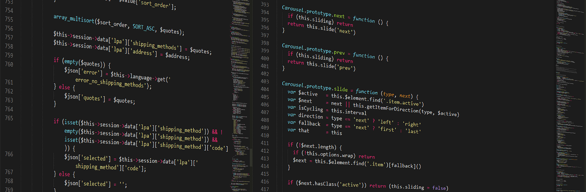

# ZERN™ Framework

> **ZERN™ Framework | Eirvo™**
> The framework that respects your work-flow, letting you structure and implement solutions on your terms.
> *"Your project, your work-flow. So code your way" - <cite>[ODAO™ OSAWERE](https://www.osawere.com)</cite>*

## Impression

ZERN™ Framework is a web framework which aims to be simple, small and extremely flexible in helping you swiftly write simple but powerful code for your application and API. ZERN™ is an evolving micro-framework (library) for developing modem responsive static or dynamic website, database driven web applications, prototyping, APIs, and other web services quickly yet efficiently using PHP, SQL (MySQL), HTML, CSS, JS & derived/relative technology while maintaining a small footprint and respecting the developer’s work-flow.

ZERN™ Framework is a free and open-source, Apache licensed project maintaining vanilla languages combined with clean code separation using a derivative of Model–view–controller architecture.

